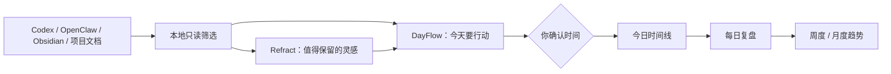
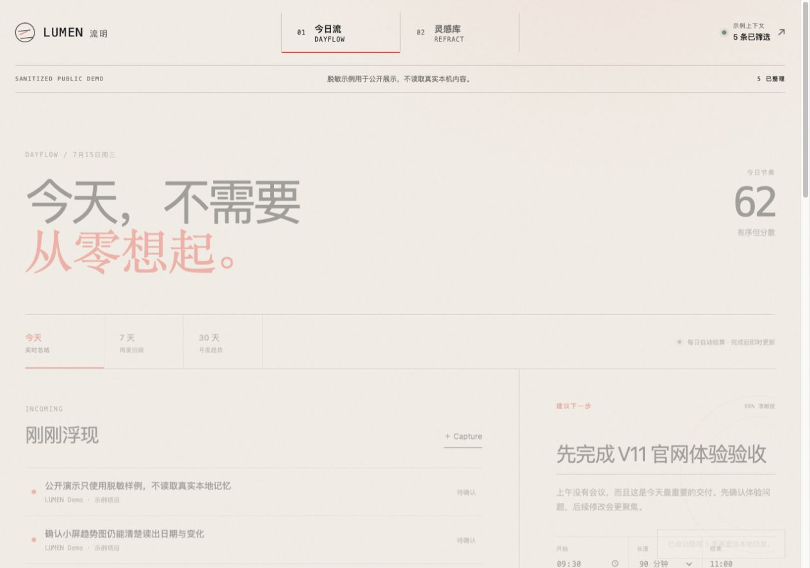
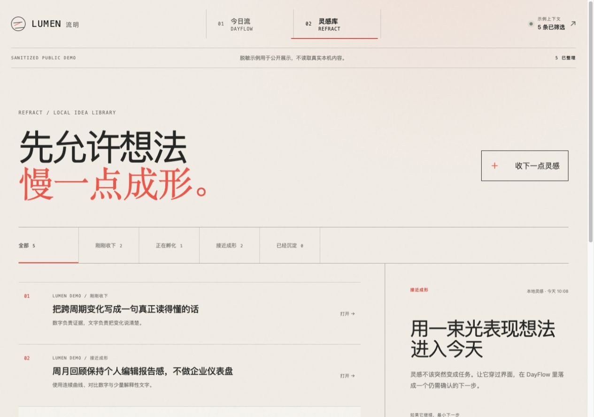

# LUMEN 流明

[](https://github.com/bigpowert25-del/lumen/actions/workflows/ci.yml)
[](./LICENSE)

> 把散落在 Codex、OpenClaw、Obsidian 和项目文档里的工作线索，自动整理成：**今天做什么、哪些灵感值得保留、昨天学到了什么。**

LUMEN 是一个运行在自己电脑上的**个人工作记忆助手**。它不是又一个要靠手工维护的任务清单，而是从本地资料中只读提取未完成事项、项目变化、决定、风险和灵感，帮你形成今日计划；工作结束后，再生成每日复盘、周度回顾和月度趋势。

所有整理都可以自动进行，但任何事项真正进入今天的时间线之前，仍需要你确认一次。数据默认只留在本机。

这是可运行的 React + Node.js MVP，不是静态设计稿。

## 它解决什么问题

- **每天开始工作时，不想重新翻遍昨天的 AI 对话和项目文档。** LUMEN 自动找出仍需处理的事项，并解释为什么建议现在做。
- **灵感经常夹在任务和聊天中，过几天就找不到。** LUMEN 把尚未成熟的想法放进独立灵感库，不强迫它立刻变成任务。
- **普通任务工具只记录“做没做”，很少解释“为什么反复出问题”。** LUMEN 把成果、摩擦、根因和教训整理成每日复盘，并提出带证据的改进候选。
- **周报和月报总要临时回忆。** LUMEN 用本地历史自动生成 7 天和 30 天趋势，缺失日期会明确显示为“未记录”。

## 一次真实使用会发生什么

假设昨天的 Codex 对话提到“移动端趋势图需要验收”，项目文档里还留着“补齐公开说明”，同时有一条尚未成熟的产品电影灵感：

1. LUMEN 只读扫描这些本地来源，排除凭据、原始对话、缓存和低置信噪音。
2. “移动端验收”和“补齐说明”进入 **DayFlow 今日流**，成为带来源和理由的建议。
3. 产品电影想法进入 **Refract 灵感库**，保留来源、成熟度和最小下一步。
4. 你调整建议的开始时间和时长，确认后它才会进入今天的时间线。
5. 第二天，LUMEN 根据完成记录、项目与对话信号生成复盘：推进了什么、问题根因是什么、得到什么教训、明天最重要的三件事是什么。



## 两个模块，一个闭环

| 模块 | 用来做什么 | 你会看到什么 |
|---|---|---|
| **今日流 / DayFlow** | 把已经需要行动的内容组织成今天 | 自动建议、原因、冲突检查、轻确认、时间线、实时日总结、7 天回顾、30 天趋势、每日复盘 |
| **灵感库 / Refract** | 保护还没有成熟的判断 | 灵感阶段、来源、成熟度、最小下一步，以及“送往今日流” |

两者共用同一份本地状态。Refract 的最小下一步可以自动成为 DayFlow 建议，但不会未经确认写入时间线。

## 界面预览

### 今天：自动整理，但由你决定



### 第二天：把昨天变成今天的判断


复盘按“成果 → 问题根因 → 教训 → 改进候选 → 明日三项优先级”展开。AGENTS / Skills 只会作为有证据的候选展示，不会被 LUMEN 自动修改。

### 灵感：先保留，再决定是否行动



## 先看脱敏演示

需要 Node.js 20 或更高版本。

```bash
git clone https://github.com/bigpowert25-del/lumen.git
cd lumen
npm install
npm run demo
```

浏览器打开 [http://127.0.0.1:4312/?demo=1&fresh=1](http://127.0.0.1:4312/?demo=1&fresh=1)。Demo 模式只读取仓库内的虚构样例，使用独立浏览器状态，适合截图、录屏和公开展示。

## 使用真实本地上下文

```bash
npm run dev
```

浏览器打开 [http://127.0.0.1:4311](http://127.0.0.1:4311)。本地模式启动后会自动执行第一次只读扫描；所有结果留在本机。

生产模式：

```bash
npm run build
npm start
```

测试与构建一次完成：

```bash
npm run check
```

`npm run check` 会依次运行状态流测试、Demo 数据测试、公开安全检查和生产构建。

## 每日复盘、周度与月度更新

- 当天每次确认、完成或撤回都会立即刷新日总结。
- 页面打开期间每分钟检查一次本地日期；跨过午夜后自动把昨天固化进历史、生成一份复盘，并开始新一天。
- 如果几天没有打开，缺失日期会明确标成“未记录”，不会伪装成低效率。
- 7 天和 30 天回顾都与前一等长周期对比，给出专注曲线、完成率、稳定度、时间构成与文字结论。
- 每日复盘按“成果、问题根因、教训、升级候选、明日三项优先级”组织，并同时展示项目、对话信号和证据项覆盖量。
- AGENTS / Skills 只作为带证据的升级候选展示；LUMEN 不直接修改全局规则，真正的采用、修改与回滚由使用者或独立治理流程负责。
- 最近 31 份复盘保存在本地状态中，旧版本状态会自动迁移到 v5。
- 状态仅保存在对应模式的浏览器 `localStorage`；Demo 与本地模式彼此隔离。

## 自动上下文如何工作

本地 Node 服务默认优先扫描以下范围，同时保留用户目录作为兜底：

1. `~/Documents/Obsidian Vault`
2. `~/Documents/完项目`
3. `~/Documents`
4. `~/.codex/memories`
5. `~/.openclaw/workspace`
6. `~`

只保留明确未完成清单、当前阻塞、项目状态变化、稳定决定、风险和可发展灵感。相同信号按稳定指纹去重，每个来源与项目都有数量上限；筛选规则升级后，旧的自动噪音会被清理，用户已经确认过的工作不会丢失。

可以用环境变量缩小扫描范围，多个路径使用 macOS 的 `:` 分隔：

```bash
LUMEN_SCAN_ROOTS="$HOME/Documents:$HOME/.codex/memories" npm run dev
```

## 隐私边界

- 扫描只读，不写回任何来源文件。
- 服务只监听 `127.0.0.1`，没有云端上传。
- 凭据文件、数据库、Cookie、密钥、缓存、构建产物、原始对话、历史运行记录、个人/健康/家庭目录和旧记忆镜像会被排除。
- 疑似密钥行和敏感个人内容在解析前丢弃。
- 低置信与超额候选只计入“已隐藏”，不会进入前端或浏览器存储。
- 产品状态保存在浏览器 `localStorage`；扫描索引保存在 `runtime/context-index.json`，该文件已加入 `.gitignore`。

## 项目结构

```text
lumen/
├── src/                    React 双模块界面与交互
├── server/                 本地 HTTP 服务、只读扫描器与测试
│   └── demo-data.mjs       可公开使用的脱敏示例信号
├── scripts/                发布前个人信息与凭据检查
├── logic.js                共享状态模型和纯业务逻辑
├── tests/                  DayFlow / Refract 状态流测试
├── design/
│   ├── PRODUCT_DESIGN.md   设计意图、用户流、设计系统与多屏说明
│   └── renders/            实机响应式验收图
├── VALIDATION.md           本轮运行与验证记录
├── ATTRIBUTION.md          来源、原创范围与 Stitch 透明声明
├── SECURITY.md             隐私模式与公开发布检查清单
├── CHANGELOG.md            版本变化记录
├── LICENSE                 MIT 许可
└── runtime/                本地临时索引，不提交
```

## Stitch 流程说明

本项目来源任务要求演示“Stitch 设计 → Codex 实现”。本轮没有声称成功登录或导出 Stitch；设计阶段以本地设计画布、设计文档和多屏渲染替代，并在 [design/PRODUCT_DESIGN.md](./design/PRODUCT_DESIGN.md) 中保留完整交付。原 `08-stitch-codex-app/` 继续作为只读设计档案，没有被修改。完整来源边界见 [ATTRIBUTION.md](./ATTRIBUTION.md)。

## 公开发布安全

仓库已经提供脱敏 Demo、MIT 许可、来源说明和自动公开安全检查。公开前建议最后执行：

```bash
npm run check
```

确认只提交源码、文档与 Demo 截图；`node_modules/`、`dist/`、`runtime/*.json` 和真实扫描结果均已忽略。公开仓库中的复盘内容全部是虚构样例，不包含真实项目名、对话或本机路径。

## 当前 MVP 边界

当前版本不连接真实邮箱、日历、飞书、钉钉或微信，不调用云端 LLM，也不做跨设备同步。上下文判断使用透明、可测试的本地规则；复盘只提出升级候选，不会直接写入全局 AGENTS、Skills 或共享记忆。这些边界是有意保留的安全选择。
