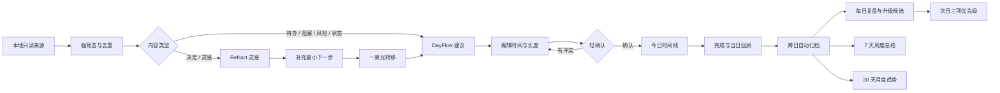
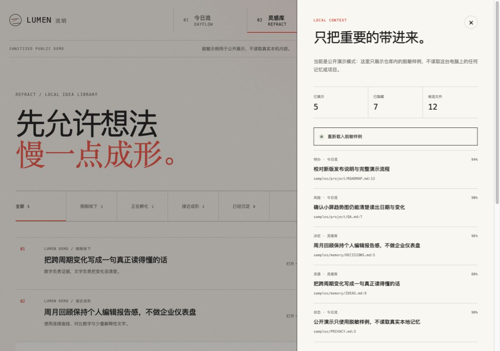
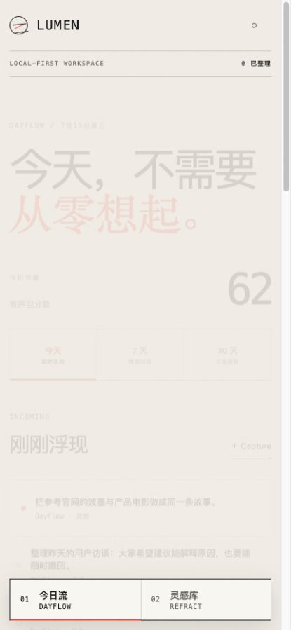
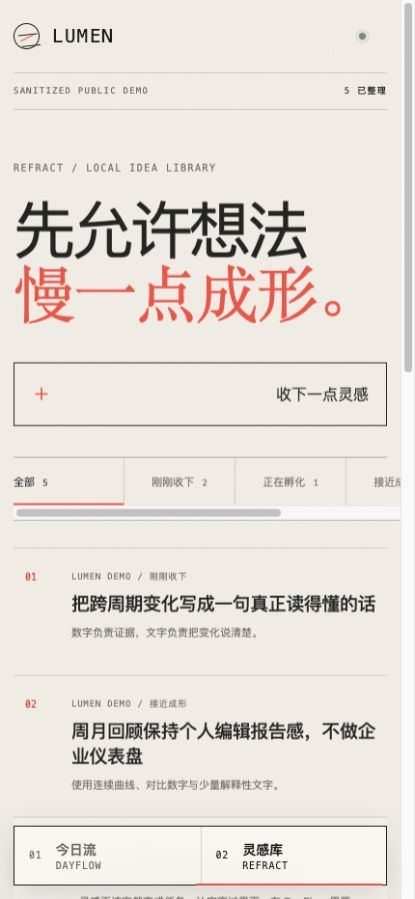
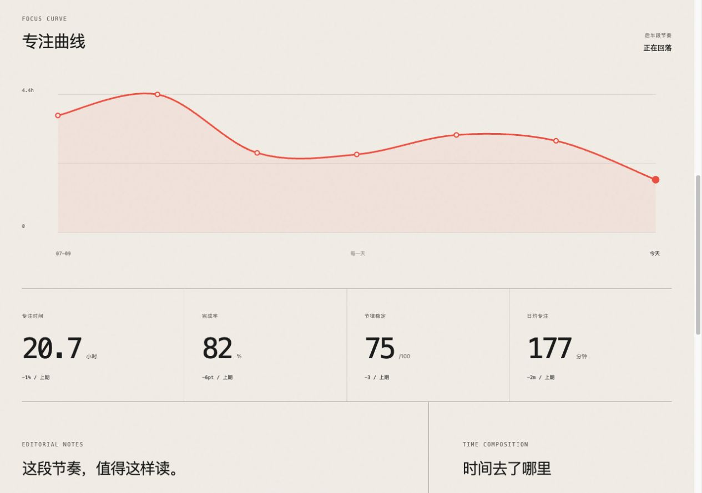
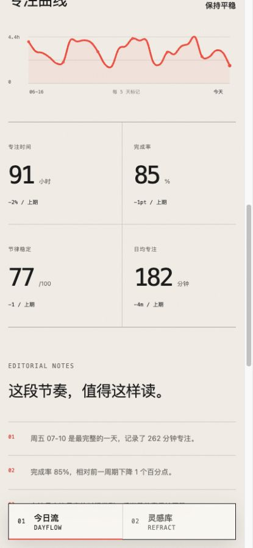
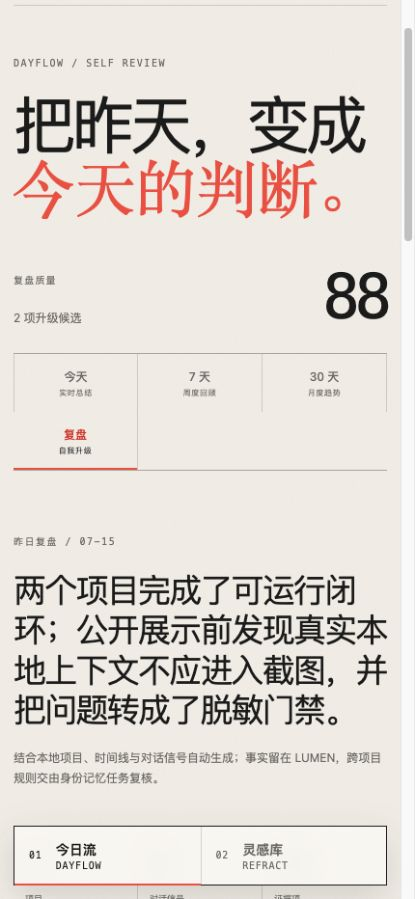

# LUMEN 流明｜产品与界面设计

版本：1.2  
日期：2026-07-16  
实现仓库：`LUMEN`

## 设计意图

LUMEN 不是又一个任务管理器，也不是堆满卡片的“第二大脑”。它处理的是同一段工作生命里的两个速度：

- **DayFlow / 今日流**承接已经需要行动的内容，让今天有清楚形状。
- **Refract / 灵感库**保护还没成熟的判断，不逼它过早变成任务。
- **Local Context / 本地上下文**在底层安静整理 Codex、OpenClaw、共享记忆和项目变化，只把足够明确的部分浮出。
- **Self Review / 复盘**把前一天变成可复用判断：先讲证据，再提炼根因、教训和升级候选。

产品的核心承诺是：整理可以自动，真正占用时间必须由人确认；系统升级可以被建议，但必须带证据、可治理、可回滚。

## 用户流

日常使用时，用户无需先整理来源：打开 LUMEN 后，新信号自动分流。只有当建议即将占用某段时间，界面才要求一次明确点击。

## 信息架构

顶部只有两个同级入口，没有常驻企业式侧栏：

| 层级 | 表面 | 作用 |
|---|---|---|
| 01 | 今日流 / DayFlow | Capture、建议、确认、时间线、日总结、周/月趋势、每日复盘与升级候选 |
| 02 | 灵感库 / Refract | 灵感阶段、详情、最小下一步、跨模块连接 |
| 底层 | 本地上下文 | 扫描状态、筛选统计、来源路径、手动刷新 |

移动端把两个模块切换固定在底部，保持单手可达；本地上下文仍从右侧抽屉进入。

## 设计系统

### 视觉概念

“温暖纸张上的一道珊瑚色折光”。界面保持安静、低密度和编辑感，用排版与细线建立秩序，而不是用层层卡片制造层级。

### 色彩

| Token | 色值 | 用途 |
|---|---|---|
| Paper | `#F3F0E8` | 主背景 |
| Paper Light | `#FAF8F2` | 编辑层与抽屉 |
| Ink | `#1B1D1C` | 主文字、确认动作 |
| Muted | `#76756E` | 元信息 |
| Coral | `#F05D44` | 唯一主强调、跨模块折光 |
| Sage | `#839681` | 本地在线、完成状态 |

### 字体与排版

- 中文正文：系统苹方优先，完全离线。
- 数字与系统标签：`SFMono-Regular` 优先。
- 强调斜体：宋体/Georgia 回退，用于“另一种速度”的语义。
- 桌面主标题 50–88px，移动端 46–67px；正文保持 11–14px 的克制密度。

### 网格与动作

- 桌面内容最大宽度 1360px；主模块采用非对称双栏。
- 8px 基础节奏，关键区块使用 40–84px 留白。
- 状态变化使用 180–760ms；Refract → DayFlow 转移由一颗珊瑚光点横穿屏幕完成。
- `prefers-reduced-motion` 下动画压缩为 1ms。

### 交互原则

1. 自动分流不打断。
2. 建议必须解释原因。
3. 只有写入时间线需要确认。
4. 冲突留在原地解决，不弹出复杂对话框。
5. 自动条目保留来源路径；来源本身始终只读。
6. 周/月趋势使用滚动周期与前一等长周期比较；无记录日期明确留白。
7. 复盘按“事实 → 根因 → 教训 → 升级候选”递进，升级建议必须显示证据数与置信度。
8. LUMEN 不直接改全局 AGENTS / Skills；跨项目治理交给独立的身份记忆任务。

## 多屏稿与实现映射

### 1. DayFlow 桌面

大标题表达当日节奏；左侧是刚刚浮现，右侧是唯一优先建议，下方时间线让确认结果立即可见。

### 2. Refract 桌面

左侧按阶段浏览灵感，右侧编辑最小下一步；“送往今日流”不会直接占用时间。

### 3. 本地上下文抽屉

展示可见、隐藏和候选数量，逐条保留置信度与本地来源。抽屉不提供来源编辑能力。

### 4. DayFlow 手机

信息顺序改为单列，双模块切换下沉到底部；确认区和时间线保持完整。

### 5. Refract 手机

阶段筛选可横向滚动，灵感列表保持大触控面，详情自然落在列表之后。

### 6. 周度趋势桌面

周度回顾像一页安静的个人编辑报告：连续专注曲线先讲变化，四个数字给出证据，下面再解释最完整的一天、完成率和时间构成。

### 7. 月度趋势手机

月度信息在手机上重排为单列，但不压缩成企业仪表盘。30 根日痕迹保持同屏可见，日期按 5 天抽样标记。

### 8. 复盘与自我升级桌面

首屏先给出一句可复述的昨日判断与复盘质量分，再以项目、对话信号和证据项数量标明依据。正文依次展示真正推进的成果、问题根因、可复用教训、升级候选与最多三项次日优先级。

### 9. 复盘与自我升级手机

手机首屏保留完整主张、质量分和四周期切换。详细证据在纵向滚动中展开，不牺牲字号，也不把升级候选压成难读的表格。

## 复盘总结规则

1. **先取证**：统计前一天完成与未完成时间块、待处理 Capture、相关项目和对话信号。
2. **再归因**：把摩擦写成“现象、根因、教训”，避免只复述失败。
3. **谨慎升级**：只有重复出现且有多项证据支撑的问题，才进入 AGENTS / Skill / 工作循环候选。
4. **限制输出**：当天最多保留三项次日优先级，防止复盘反过来制造任务噪音。
5. **分离治理**：LUMEN 保存候选和证据，不直接修改跨项目规则；身份记忆任务负责评审、落地与回滚。

## 公开 Demo 画布

所有仓库展示图都必须从 `npm run demo` 与 `?demo=1&fresh=1` 生成。画布中的来源路径固定指向 `samples/`，不会读取或展示真实本机记忆。真实本地模式仅用于个人使用与功能验证。

## Stitch 透明声明

本轮未使用可验证的 Stitch 登录态或导出文件，因此没有编造“已从 Stitch 导出”。设计意图、用户流、Token、多屏画布和实现映射全部通过本地文档与真实浏览器渲染完成；这模拟了同样的“设计先行 → Codex 实现 → 多端验收”流程。`08-stitch-codex-app` 保持原样，作为只读设计档案。任务参考来源与原创边界见仓库根目录 `ATTRIBUTION.md`。
